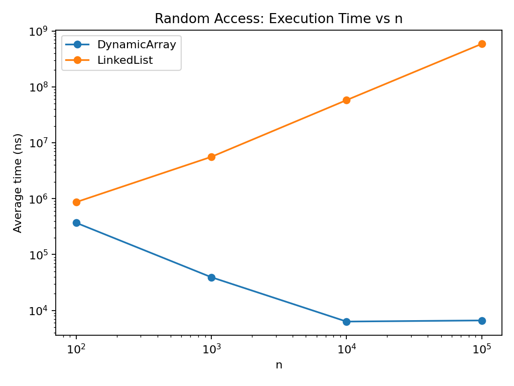
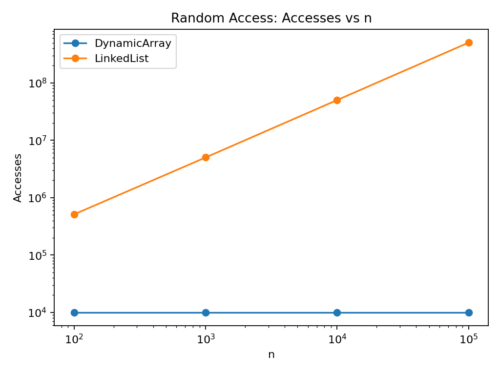
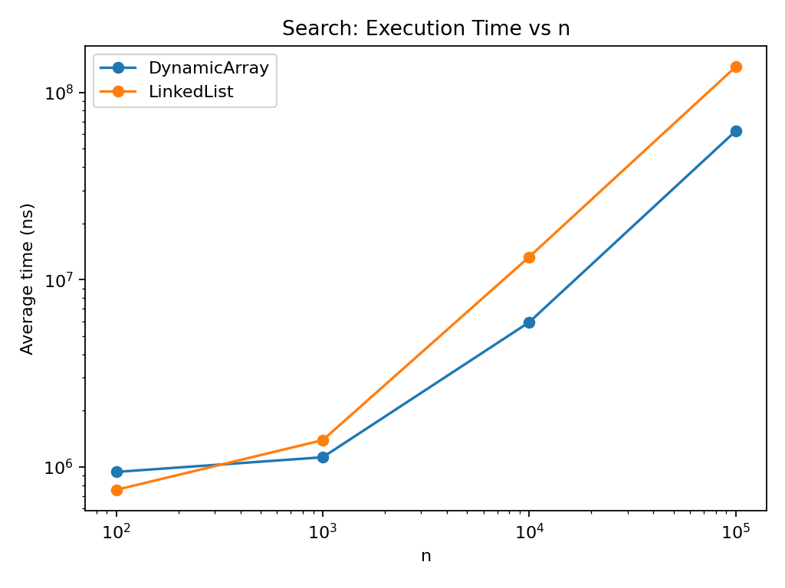
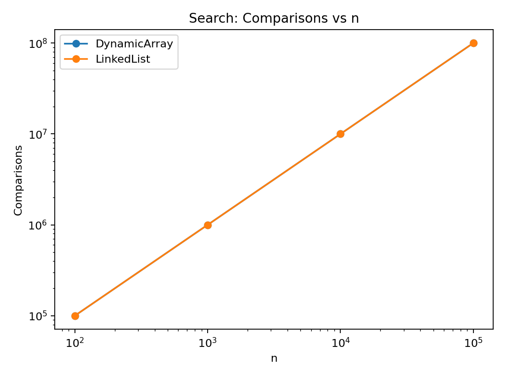
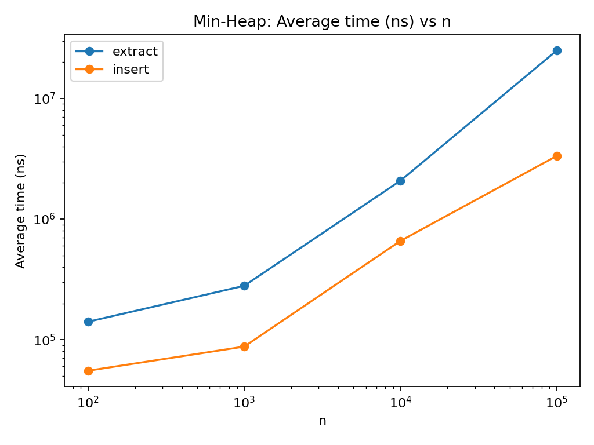
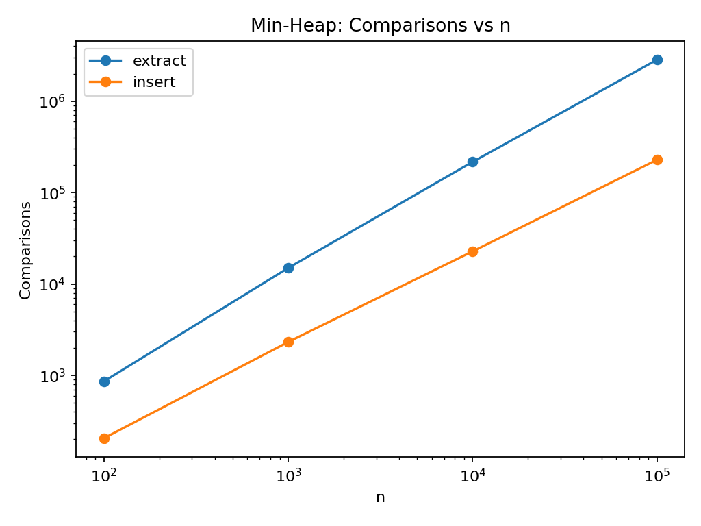

# Assignment 2 — Algorithmic Analysis, Correctness and Performance Trade-offs

## Overview

This project implements three data structures in Java without using Java collection classes as the main implementation: a Dynamic Array, a singly Linked List, and a Min-Heap. The purpose is to compare theoretical complexity with measured performance and to show how the internal organization of a data structure changes the cost of operations.

The project also contains correctness tests and four benchmark workloads. Every benchmark uses `System.nanoTime()`, fixed random data, and five repetitions. Input generation is outside the measured section.

## Project Structure

```text
assignment-2/
├── src/
│   ├── DynamicArray.java
│   ├── LinkedList.java
│   ├── MinHeap.java
│   ├── Benchmark.java
│   └── Tests.java
├── results/
│   ├── tables/
│   └── plots/
└── README.md
```

## Complexity Analysis

### Dynamic Array

| Operation | Best | Average | Worst | Auxiliary space |
|---|---|---|---|---|
| `add(x)` | Ω(1) | Θ(1) amortized | O(n) | O(n) during resize |
| `add(index, x)` | Ω(1) | Θ(n) | O(n) | O(n) during resize |
| `remove(index)` | Ω(1) | Θ(n) | O(n) | Θ(1) |
| `get(index)` | Ω(1) | Θ(1) | O(1) | Θ(1) |
| `contains(x)` | Ω(1) | Θ(n) | O(n) | Θ(1) |

`get` is constant time because an array element can be found directly by its index. Adding at the end is normally constant time, but resizing copies all current elements. Insertion and removal near the beginning require shifting many elements. Search is linear because elements may need to be checked one by one.

### Linked List

| Operation | Best | Average | Worst | Auxiliary space |
|---|---|---|---|---|
| `add(x)` | Ω(1) | Θ(1) | O(1) | Θ(1) |
| `add(index, x)` | Ω(1) | Θ(n) | O(n) | Θ(1) |
| `remove(index)` | Ω(1) | Θ(n) | O(n) | Θ(1) |
| `get(index)` | Ω(1) | Θ(n) | O(n) | Θ(1) |
| `contains(x)` | Ω(1) | Θ(n) | O(n) | Θ(1) |

The list stores a tail reference, so adding at the end is constant time. Access to an arbitrary index requires traversal from the head. Insertion and removal at index 0 are constant time, while middle positions require traversal.

### Min-Heap

| Operation | Best | Average | Worst | Auxiliary space |
|---|---|---|---|---|
| `insert(x)` | Ω(1) | O(log n) | O(log n) | Θ(1), except resize |
| `peekMin()` | Ω(1) | Θ(1) | O(1) | Θ(1) |
| `extractMin()` | Ω(1) | Θ(log n) | O(log n) | Θ(1) |

The minimum is always stored at index 0, so `peekMin` is constant time. Insert can move an item upward through heap levels. Extraction replaces the root with the last item and moves it downward until the heap property is restored. A binary heap has logarithmic height.

## Correctness

### Loop invariant 1: Dynamic Array insertion at an index

Operation: `add(index, x)`.

**Invariant.** Before each iteration of the shifting loop with current position `i`, every original element from positions `i` through `size - 1` that has already been processed is stored one position to the right, and no unprocessed original element has been overwritten.

**Initialization.** The loop starts with `i = size`. No original element has been moved yet. The free position at `size` is available, so the invariant is true before the first shift.

**Maintenance.** In one iteration, the value at `i - 1` is copied to `i`. The loop moves from right to left. Because the destination is on the right, copying this value cannot destroy an element that is still needed later. After the copy, one more original element is correctly shifted by one position. Therefore the invariant remains true.

**Termination.** The loop stops when `i == index`. At this moment, every original element from `index` to `size - 1` has been moved to the next position. Position `index` is free.

**Correctness.** The new value is written into the free position `index`. Elements before the index were not changed, the new value is at the requested index, and all later elements keep their original order. Therefore insertion is correct.

### Loop invariant 2: Min-Heap insertion

Operation: `insert(x)`.

**Invariant.** At the beginning of every iteration of the upward movement loop, the heap property is valid everywhere except possibly between the current node `i` and its parent.

**Initialization.** Before insertion, the structure is a valid min-heap. The new element is placed at the last position. Existing parent-child relations do not change, so the only possible violation is between the new node and its parent.

**Maintenance.** If the parent is less than or equal to the current node, the property is already valid and the loop ends. Otherwise, the two values are swapped. The smaller value moves upward and fixes the violated relation. The only new possible violation is now between the moved value and its new parent. All other heap relations stay valid, so the invariant is preserved.

**Termination.** The loop terminates when the node reaches the root or its parent is not greater than it.

**Correctness.** At termination there is no remaining parent-child violation. Since the invariant states that all other relations are valid, the whole structure satisfies the min-heap property.

## Experimental Setup

The tested values of `n` are 100, 1,000, 10,000, and 100,000. Random access uses 10,000 `get` operations. Search uses 1,000 `contains` operations. Insertion uses 1,000 operations. For removal, the benchmark uses `min(1000, n)` removals because a structure that starts with only 100 elements cannot perform 1,000 removals without becoming empty. For middle removal, the middle index is recalculated from the current size for the same reason.

Every experiment is repeated five times and the average execution time is reported. Timing uses `System.nanoTime()`. Data is generated before timing. Fixed seeds are used so that the experiments are reproducible.

## Results

### Workload 1 — Random Access

| n | Dynamic Array time (ns) | Array accesses | Linked List time (ns) | List accesses |
|---:|---:|---:|---:|---:|
| 100 | 369,845 | 10,000 | 867,455 | 511,508 |
| 1,000 | 39,313 | 10,000 | 5,599,247 | 5,015,208 |
| 10,000 | 6,331 | 10,000 | 57,868,236 | 50,139,208 |
| 100,000 | 6,628 | 10,000 | 586,498,207 | 502,499,208 |

The Dynamic Array keeps the same number of element accesses because each index is accessed directly. The Linked List needs more node traversal as `n` grows. This agrees with Θ(1) array access and Θ(n) linked-list access. Small timing differences for the array are caused by JVM warm-up, caching, and timer noise.





### Workload 2 — Search

| n | Dynamic Array time (ns) | Array comparisons | Linked List time (ns) | List comparisons |
|---:|---:|---:|---:|---:|
| 100 | 942,476 | 100,000 | 756,293 | 100,000 |
| 1,000 | 1,128,566 | 1,000,000 | 1,392,840 | 1,000,000 |
| 10,000 | 5,933,976 | 10,000,000 | 13,238,133 | 10,000,000 |
| 100,000 | 62,144,966 | 100,000,000 | 136,781,088 | 100,000,000 |

Both structures perform a linear search and the comparison counts grow directly with `n`. Their Big-O complexity is the same, but the Dynamic Array becomes faster for large inputs because its elements are stored next to each other in memory. The Linked List follows node references, which has a larger practical cost.





### Workload 3 — Insertion and Removal

The complete table is stored in `results/tables/insert_remove.csv`. The clearest large-input result is for `n = 100,000`:

| Structure | Operation | Position | Average time (ns) | Movements / accesses |
|---|---|---|---:|---:|
| Dynamic Array | insert | beginning | 229,320,408 | 100,500,500 |
| Dynamic Array | insert | middle | 114,764,811 | 50,500,500 |
| Dynamic Array | remove | beginning | 212,989,502 | 99,500,500 |
| Dynamic Array | remove | middle | 108,427,315 | 49,750,500 |
| Linked List | insert | beginning | 74,791 | 0 |
| Linked List | insert | middle | 59,144,358 | 50,000,000 |
| Linked List | remove | beginning | 3,316 | 0 |
| Linked List | remove | middle | 58,820,989 | 49,750,000 |

The results show the physical difference between the structures. A Dynamic Array must move elements when inserting or removing before the end. At the beginning it moves almost the whole array, while the middle moves about half. A Linked List changes references quickly at the head, but reaching the middle requires traversal. Therefore a linked list is very effective for operations at the beginning, but not for random middle positions.

### Workload 4 — Priority Processing

| n | Insert time (ns) | Insert comparisons | Extract time (ns) | Extract comparisons | Sorted |
|---:|---:|---:|---:|---:|---|
| 100 | 55,275 | 206 | 140,762 | 863 | true |
| 1,000 | 87,552 | 2,326 | 279,502 | 14,996 | true |
| 10,000 | 658,479 | 22,753 | 2,078,060 | 216,531 | true |
| 100,000 | 3,332,566 | 227,857 | 24,917,625 | 2,831,426 | true |

The extracted sequence was non-decreasing for every tested size. The number of comparisons increases as the heap becomes larger. Extraction is more expensive than insertion in these measurements because every extraction normally moves the replacement root down several levels. The results are consistent with logarithmic work per heap operation and constant-time `peekMin`.





## Discussion

Increasing `n` has almost no theoretical effect on Dynamic Array random access, but it strongly affects Linked List random access because more nodes must be visited. Search becomes more expensive for both structures because both use linear search. In insertion and removal, position is very important: arrays pay for shifting, while linked lists pay for traversal. Heap processing grows efficiently because its height grows logarithmically.

The measured operation counts agree closely with the theoretical analysis. Timing is less exact because Big-O does not describe constants, memory layout, CPU cache, JVM optimization, garbage collection, or timer noise. This is why two Θ(n) algorithms can still have clearly different execution times.

A good example is `contains`. Both implementations are Θ(n), and both make the same number of value comparisons in this experiment. However, the Dynamic Array is faster at large `n`. Sequential array memory has good cache locality. Linked-list nodes are separate objects and require pointer traversal.

Constant factors also matter for small inputs. For example, an operation with a theoretically better growth rate can have similar or even worse measured time when `n` is small. As the input becomes larger, the growth pattern becomes easier to see.

## Testing and Correctness Validation

`Tests.java` checks empty structures, one element, multiple elements, duplicate values, boundary behavior, invalid indices, and a large Dynamic Array. Heap tests check the heap property after every insertion and extraction. They also check that repeated `extractMin()` returns values in non-decreasing order.

Run the tests with assertions enabled:

```bash
javac src/*.java
java -ea -cp src Tests
```

Run the benchmark from the project root:

```bash
java -cp src Benchmark
```

## Design Recommendations

A Dynamic Array is suitable when a program needs frequent access by index, iteration, and compact storage. It is less suitable for many insertions or removals near the beginning because elements must be shifted.

A Linked List is useful when operations are concentrated at the beginning, or when a program already has a reference to the position where a link must change. It is not a good choice for frequent random access because reaching an index requires traversal.

A Min-Heap is suitable for priority processing when the smallest value must be available quickly. `peekMin` is constant time, while insertion and extraction need at most logarithmic movement through the heap levels.

The best data structure therefore depends on the workload. The same structure cannot be the fastest for every type of operation.

## Conclusion

The experiments show that theoretical complexity is a useful prediction of growth, but real execution time also depends on implementation details and memory behavior. Dynamic Array random access stayed effectively constant while Linked List random access grew with input size. Both searches were linear, but the array had better practical performance for large inputs. Linked List operations at the beginning were very fast, while Dynamic Array operations at the beginning required many movements. The Min-Heap maintained sorted priority extraction with efficient logarithmic operations.

The main result is that data-structure choice should be based on the operations that a program performs most often, not only on one Big-O value.
